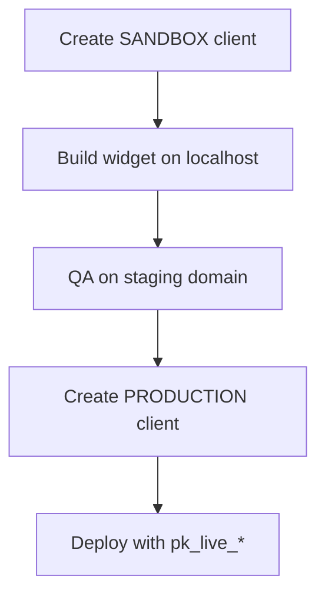

Every API client and widget belongs to one environment.

## Production (`PRODUCTION`)

- Keys: `pk_live_*`, `sk_live_*`
- Data: real **ACTIVE** reviews for your organization
- Widget shows top-rated reviews (`minStars` default 4, sort `top`)
- Use on your public website after testing

## Sandbox (`SANDBOX`)

- Keys: `pk_test_*`, `sk_test_*`
- Data: **synthetic demo testimonials** — isolated from production
- Same API paths and response shape as production
- Use during development and CI without affecting live ratings

<Check>
  Sandbox and production credentials are fully separate. Rotating or revoking one does not affect the other.
</Check>

## Recommended workflow

## Dashboard checklist

| Step | Sandbox | Production |
| ---- | ------- | ---------- |
| API client | `pk_test_*` + `sk_test_*` | `pk_live_*` + `sk_live_*` |
| Allowed origins | localhost, staging | production domain(s) |
| Widget registry | SANDBOX widget | PRODUCTION widget |
| Telegram | Optional test group | Live customer group |

[Quickstart →](/quickstart)
