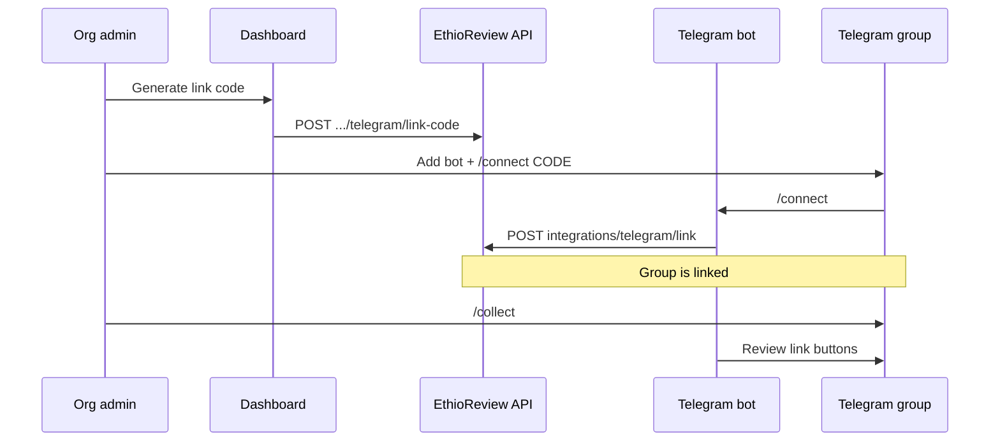

The EthioReview **Telegram integration** lets businesses:

1. **Link a Telegram group** to their organization profile
2. **Collect reviews** by posting a touchpoint link (`/collect` in the group)
3. **Receive notifications** when new reviews are published

## Components

| Component | Role |
| --------- | ---- |
| EthioReview dashboard | Generate link codes, view connection status |
| Backend API | `organizations/{id}/telegram/*`, `integrations/telegram/*` |
| Telegram bridge | `packages/telegram-bots` — bot commands, review relay |

## Bot commands

| Command | Who | Action |
| ------- | --- | ------ |
| `/start` | Anyone | Help; auto-connect via deep link |
| `/connect <code>` | Group member | Link group using dashboard code |
| `/collect` | Group admin | Post customer review collection link |

[Connect a group →](/integrations/telegram/connect-group)
