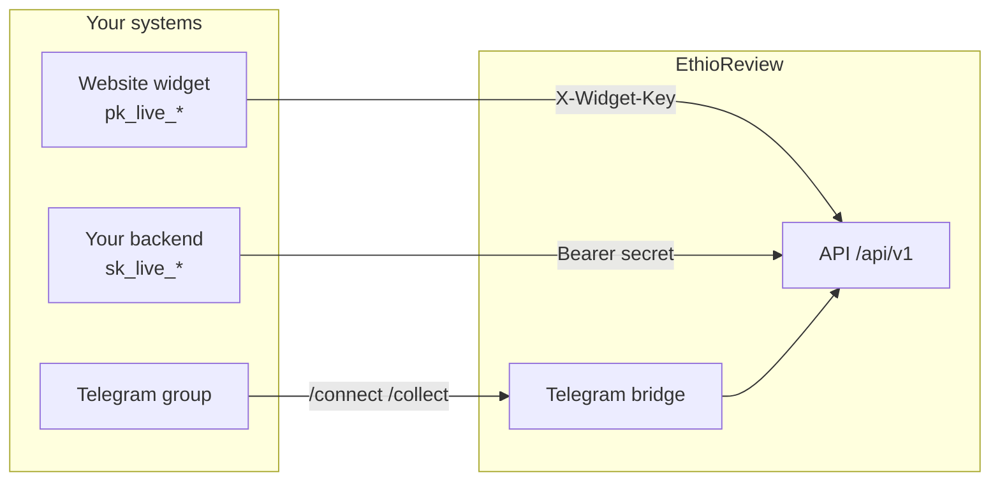

EthioReview provides **developer tools** for businesses and government organizations to:

- **Embed top-rated testimonials** on any website via the Review Widget
- **Connect a Telegram group** to collect reviews and receive new-review notifications
- **Fetch review data server-side** with API client credentials

<Note>
  This site is the **developer documentation portal**. Day-to-day setup (creating keys, linking Telegram) happens in the [EthioReview dashboard](https://app.ethioreview.com) under **Integrations**. Use this portal for step-by-step guides and API reference.
</Note>

## What you will build

<CardGroup cols={2}>
  <Card title="Review widget" icon="code" href="/integrations/widget/overview">
    Show top-rated reviews with reviewer names on your site. Uses a publishable key in the browser.
  </Card>
  <Card title="Telegram bot" icon="message" href="/integrations/telegram/overview">
    Link a Telegram group, collect reviews via `/collect`, and get notified when reviews publish.
  </Card>
</CardGroup>

## Architecture at a glance

## Repositories

| Repo | Purpose |
| ---- | ------- |
| [ethioreview/backend](https://github.com/ethioreview/backend) | NestJS API, OpenAPI spec |
| [ethioreview/review-widget](https://github.com/ethioreview/review-widget) | Widget SDK monorepo (React, Web Component, iframe) |
| [ethioreview/docs](https://github.com/ethioreview/docs) | This Mintlify site (source of truth for integrator docs) |
| [ethioreview/telegram-bots](https://github.com/ethioreview/telegram-bots) | Telegram bridge service |

## Next steps

<Steps>
  <Step title="Quickstart">
    Create sandbox credentials and embed a test widget in 10 minutes.
    [Go to Quickstart →](/quickstart)
  </Step>
  <Step title="Widget integration">
    Production embed patterns for Web Component, React, and iframe.
    [Widget overview →](/integrations/widget/overview)
  </Step>
  <Step title="Telegram">
    Link your group from the dashboard and run `/collect`.
    [Telegram overview →](/integrations/telegram/overview)
  </Step>
</Steps>
